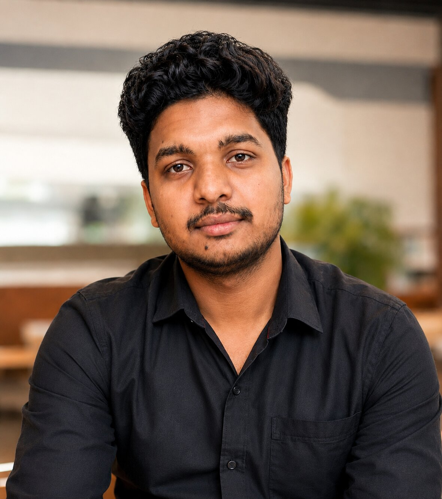

  

  <h1>Abhay Sahu</h1>
  
<i>Software Engineer — Full Stack &amp; DevOps / Cloud</i>

 

I'm a software engineer who builds and operates production systems end-to-end — from the application layer down through the infrastructure it runs on. This account is where my DevOps, cloud, and platform engineering work lives. My application and AI work lives on [@abhaysahu-cse](https://github.com/abhaysahu-cse).

I'm currently a DevOps Engineer Intern at CloudNexus DigiWeb Services, and a Computer Science student at Sagar Institute of Research & Technology (SIRT), Bhopal.

 

## What I actually do

Most of what's in this account comes down to one theme: taking an application from "it runs on my machine" to "it runs reliably in production, and I can prove it." That means:

- **Kubernetes on both major clouds** — AKS and EKS, not just one, with real Helm-based deployments and GitOps workflows (FluxCD, Argo CD)
- **CI/CD pipelines that actually enforce quality** — GitHub Actions, Jenkins, and Azure Pipelines, with Trivy security scanning and automatic rollback on failed health checks, not just "build and deploy"
- **Full-stack observability** — Dynatrace (OneAgent, Davis AI anomaly detection, distributed tracing) and the Prometheus/Grafana stack, instrumented into real multi-service applications, not demo dashboards
- **Infrastructure as Code** — Terraform for cloud provisioning, Ansible for bare-metal Kubernetes clusters where there's no managed control plane to lean on

 

## A few projects worth a look

**[SENTINEL](https://github.com/abhaysahu403/SENTINEL-Energy-Supply-Chain-Resilience)** — An energy supply chain resilience platform on Azure AKS, deployed through three independent CI/CD pipelines (GitHub Actions, Jenkins, and Azure Pipelines) with Trivy scanning and automatic rollback on failure.

**[Enterprise Observability GitOps](https://github.com/abhaysahu403/enterprise-observability-gitops)** — A 7-microservice platform on AWS EKS, fully instrumented with Dynatrace and deployed through FluxCD GitOps. I deleted a deployment mid-demo just to show Flux recreate it from Git.

**[SnackGame](https://github.com/abhaysahu403/SnackGame)** — Deliberately small on purpose: a full pipeline (Docker → ECR → Terraform-provisioned ECS) simple enough to walk through end-to-end in under ten minutes.

**[RKE2 HA Platform Automation](https://github.com/abhaysahu403/rke2-ha-platform-automation)** — Ansible-driven provisioning for a high-availability Kubernetes cluster with no managed control plane underneath it.

 

## Certifications

Five Oracle certifications, including two at the Professional level — OCI Certified Developer Professional and Oracle Database@AWS Certified Architect Professional — plus Generative AI Professional, AI Foundations Associate, and MySQL HeatWave Implementation Associate. Alongside those, two IIT-proctored NPTEL certifications (Programming in Java — Elite, and Machine Learning for Engineering and Science Applications) and real-company engineering simulations through Forage with Quantium, Skyscanner, and JPMorgan Chase.

 

## Competitions

I've now won first prize four competitions in a row. Not by luck — by taking a real problem, building it under real pressure, and shipping something a jury can actually judge.

**Claude Build Day — Fable 5.1, Bhopal** · 1st Prize, ₹31,000
A national-level hackathon organized with MPSeDC and the Government of Madhya Pradesh. Four hours, $100 in AI credits, one working application by the end of it. I built out core features of SafeSphere — AI-guided disaster drill simulations, a Smart SOS system with live location sharing, a live safety map covering hospitals, shelters, and safe zones, an institutional command dashboard for CBSE compliance tracking, and multilingual AI assistance for Indian students — on a Python/Django backend with no cloud dependency. I used Claude Fable 5.1 to accelerate the build itself — architecture decisions, debugging, iteration — but the product framing and the pressure of shipping in four hours were mine. This was my 4th consecutive first-place win.

**Eureka! Hackathon — E-Cell, IIT Bombay (NEC round)** · 1st Prize
College-level qualifying round for E-Cell IIT Bombay's flagship business-plan and hackathon competition. First place across all participating teams.

**Tech-SAGEathon 2026, SIRT Bhopal** · 1st Prize, ₹25,000
A 20-hour national hackathon with Cybrom Technology and IIT Patna's Vishlesan I-Hub Foundation. Built TrustCareer AI, an AI hiring-intelligence concept, against teams from multiple states.

**Anveshana 2025–26 (National Level)** · 1st Prize, ₹30,000
Organized by Agastya International Foundation in partnership with Synopsys. SafeSphere — the same AI disaster-preparedness platform later extended at Claude Build Day — was selected from 37 projects across 5 states.

I've also placed first in my college's internal DSA (Data Structures & Algorithms) rounds, and was named Student of the Year at Sagar Group of Institutions (SIRT Bhopal).

 

## Get in touch

- Email: abhaysahucse@gmail.com
- LinkedIn: [abhay-sahu-222226232](https://www.linkedin.com/in/abhay-sahu-222226232/)
- Application & AI work: [@abhaysahu-cse](https://github.com/abhaysahu-cse)

I'm open to full-time roles, freelance work, and collaborations where DevOps/cloud depth actually matters.
